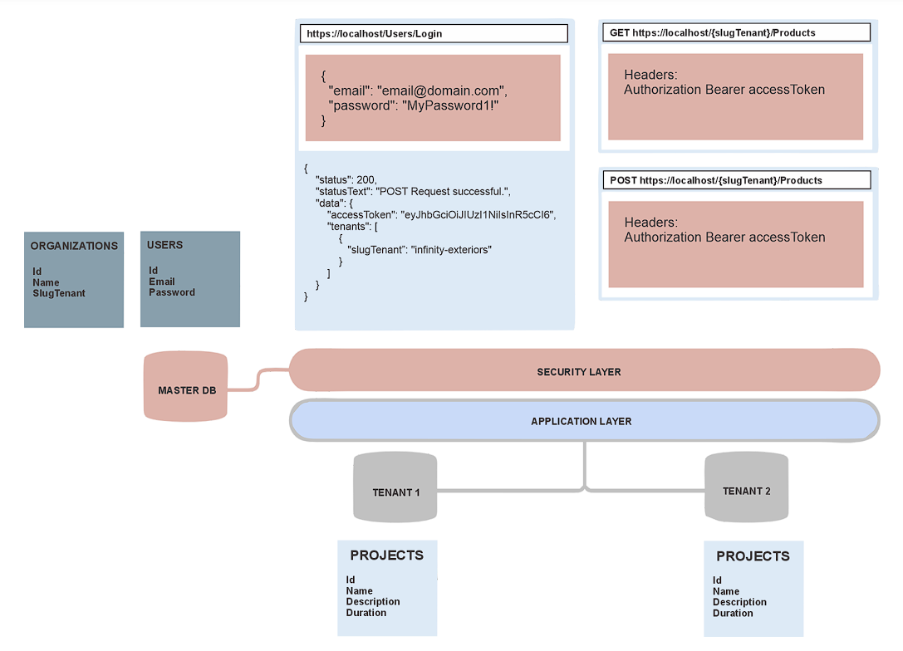

# Prueba Técnica Proyecto

## Crear un proyecto en .NET Core con Clean Architecture y soporte multitenant basado en el path de URL, utilizando dos bases de datos (una para organizaciones y usuarios y otra para productos de cada organización) implica seguir varios pasos clave. A continuación, se describen los pasos necesarios para lograr este objetivo:

1. **Configuración del Proyecto y Estructura de Carpetas:**

   - Crear un nuevo proyecto de .NET Core usando la plantilla de Clean Architecture.
   - Organizar la estructura del proyecto siguiendo los principios de Clean Architecture, separando en capas como Dominio, Aplicación, Infraestructura y API.

2. **Base de Datos:**

   - Configurar las conexiones a dos bases de datos en el archivo de configuración, una para Organizaciones y Usuarios y otra para productos por organización.
   - Utilizar Entity Framework Core o Dapper para acceder a las bases de datos.
   - Crear modelos de datos para Organizaciones, Usuarios y Productos.

3. **Implementar Multitenant basado en Path de URL:**

   - Crear un middleware personalizado que identifique el tenant (organización) basado en el path de la URL.
   - Utilizar esta información para establecer la conexión con la base de datos correspondiente para cada organización.

4. **Autenticación y Autorización:**

   - Implementar un sistema de autenticación basado en JWT para los usuarios.
   - Crear controladores y servicios para gestionar el inicio de sesión y la emisión de tokens JWT asociados al tenant.

5. **Migraciones y Módulo de Base de Datos:**

   - Crear migraciones para las bases de datos de Organizaciones/Usuarios y para cada base de datos de productos por organización.
   - Establecer scripts de migraciones que puedan ejecutarse automáticamente cuando se crea una nueva organización.

6. **Asociar Usuarios con Organizaciones:**

   - Asociar a cada usuario con una organización al registrarse o durante el proceso de creación del usuario.

7. **Manejo de Migraciones por Organización:**

   - Establecer un proceso que se ejecute cuando se crea una nueva organización para aplicar las migraciones correspondientes en su base de datos de productos.

8. **Operaciones CRUD para Productos:**

   - Implementar operaciones CRUD para los productos en la capa de aplicación.
   - Utilizar Entity Framework Core o Dapper para interactuar con la base de datos de productos de cada organización.

El diagrama es referencial, pero se requiere que sigan la estructura de multitenant con slugTenant como path.

